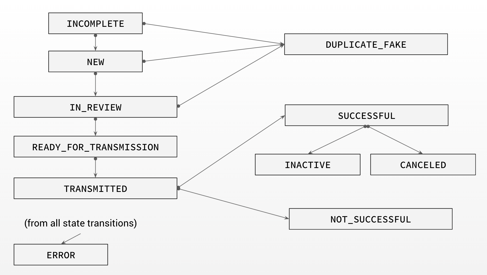

## Vorwort

Dieses Dokument beschreibt die Aufgabe “State Machine”. Der Code sollte am Ende **lesbar** und **wartbar** sein.

## Inhaltsverzeichnis

[TOC]

## Status

Nachfolgend die Visualisierung aller möglichen Status. Da während jedes Übergangs Fehler auftreten könnten, kann jeder Status auch in den ERROR-Fall übergehen.

## Szenario 1

Implementiere den Konstruktor so, dass er als Argument den Status als **String** akzeptiert.

### Methode: getLeadState

<table>
  <tr>
   <td>Wenn das Objekt sich im Status <strong>INCOMPLETE</strong> befindet, gibt die Methode <strong>INCOMPLETE</strong> zurück.
   </td>
  </tr>
  <tr>
   <td>Wenn das Objekt sich im Status <strong>NEW</strong> befindet, gibt die Methode <strong>NEW</strong> zurück.
   </td>
  </tr>
  <tr>
   <td>Wenn das Objekt sich im Status <strong>IN_REVIEW</strong> befindet, gibt die Methode <strong>IN_REVIEW</strong> zurück.
   </td>
  </tr>
  <tr>
   <td>Die Methode <strong>getLeadState</strong> soll für jeden anderen Status genauso funktionieren.
   </td>
  </tr>
</table>

### Methode: getPossibleNextStates

<table>
  <tr>
   <td>Wenn sich das Objekt im Status <strong>INCOMPLETE</strong> befindet, gibt die Methode <strong>[NEW, DUPLICATE_FAKE, ERROR]</strong> zurück.
   </td>
  </tr>
  <tr>
   <td>Wenn sich das Objekt im Status <strong>NEW</strong> befindet, gibt die Methode <strong>[IN_REVIEW, DUPLICATE_FAKE, ERROR]</strong> zurück.
   </td>
  </tr>
  <tr>
   <td>Wenn sich das Objekt im Status <strong>IN_REVIEW</strong> befindet, gibt die Methode <strong>[READY_FOR_TRANSMISSION, DUPLICATE_FAKE, ERROR]</strong> zurück.
   </td>
  </tr>
  <tr>
   <td>Die Methode <strong>getPossibleNextStates</strong> soll für jeden anderen Status genauso funktionieren.
   </td>
  </tr>
</table>

## Szenario 2

Hier geht es um die Implementierung der Möglichkeit, zwischen verschiedenen Status zu wechseln. Die Methode akzeptiert hierfür den neuen Status als **String-Parameter**.

### Methode: transitionState

<table>
  <tr>
   <td>Wenn sich das Objekt im Status <strong>NEW</strong> befindet und die Methode mit dem Parameter <strong>IN_REVIEW</strong> aufgerufen wird, gibt diese <strong>true</strong> zurück.
   </td>
  </tr>
  <tr>
   <td>Wenn sich das Objekt im Status <strong>NEW</strong> befindet und die Methode mit dem Parameter <strong>NEW</strong> aufgerufen wird, gibt diese <strong>false</strong> zurück.
   </td>
  </tr>
  <tr>
   <td>Dies soll für alle möglichen Übergänge implementiert werden.
   </td>
  </tr>
  <tr>
   <td>Dies soll ebenfalls für alle nicht möglichen Übergänge implementiert werden.
   </td>
  </tr>
</table>

## 

## Szenario 3

Hier sollst du die Möglichkeit schaffen, im Wechsel zwischen einem Status zu dem nächsten eine Validierungsmethode einzubauen.

Gegeben ist die IBAN eines Nutzers. Diese kannst du in deinem Objekt mit der Methode **getIban()** herausfinden.

### IBAN validieren

Eine IBAN hat eine integrierte Checksumme, die du nutzen kannst. Die Checksumme einer IBAN wird validiert, indem du folgende Schritte ausführst:

1. Verschiebe die ersten vier Zeichen einer IBAN an das Ende (z.B. **DE80500105175408332501 **=> **500105175408332501DE80**)
2. Ersetze jeden Buchstaben mit einer Nummer: **A => 10, B => 11, C => 12, ... Z => 35**
3. Die IBAN ist erfolgreich validiert, wenn die resultierende Nummer dividiert mit 97 wird und der Rest 1 ist.

<table>
  <tr>
   <td>
Wenn sich das Objekt im Status <strong>INCOMPLETE</strong> befindet und die Methode <strong>transitionState</strong> mit dem Parameter <strong>NEW</strong> aufgerufen wird und die IBAN <strong>DE80500105175408332501 </strong>ist, soll diese <strong>true</strong> zurückgeben. Die IBAN ist korrekt und die Transaktion soll funktionieren.
   </td>
  </tr>
  <tr>
   <td>Wenn sich das Objekt im Status <strong>INCOMPLETE</strong> befindet und die Methode <strong>transitionState</strong> mit dem Parameter <strong>NEW</strong> aufgerufen wird und die IBAN <strong>DE02370100500001651503 </strong>ist, soll diese <strong>false</strong> zurückgeben. Die IBAN ist nicht korrekt und die Transaktion soll nicht funktionieren.
   </td>
  </tr>
  <tr>
   <td>Dies soll ebenfalls für andere IBAN implementiert werden
   </td>
  </tr>
</table>

